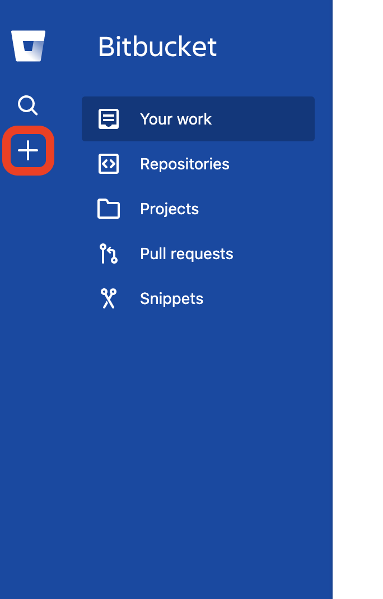
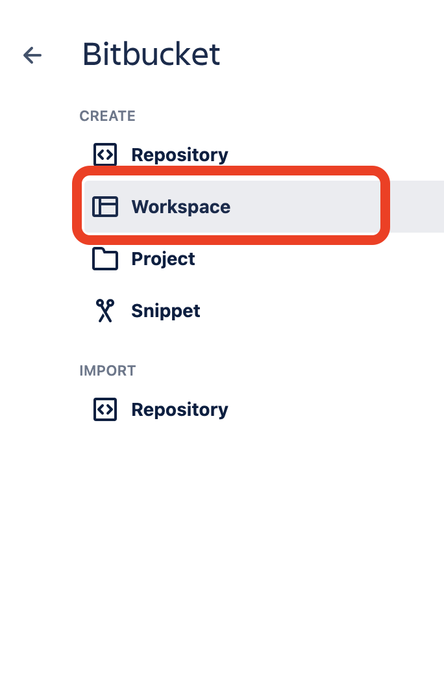
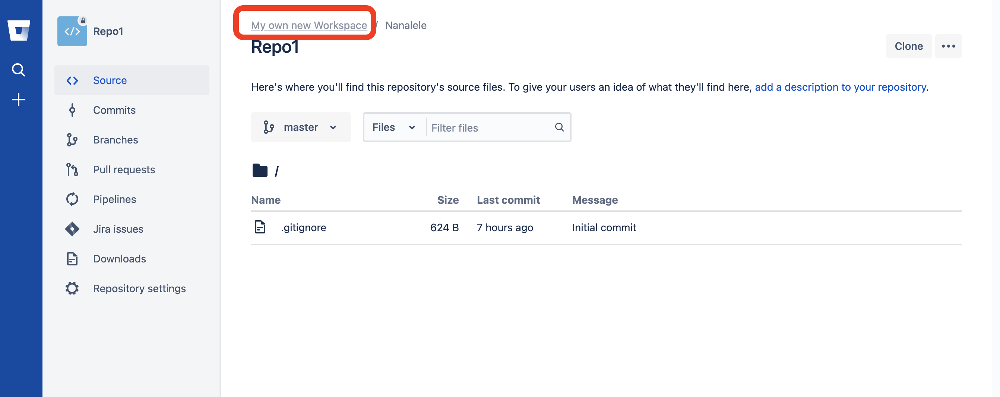
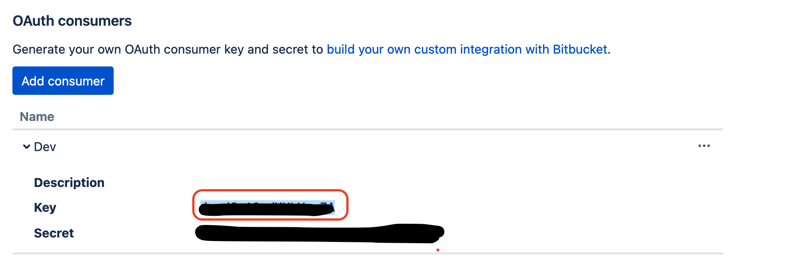

# JG-docs

## Overview
This project is yet another example integration with filesystems different types of files.
Currently, supported is only Bitbucket repository "filesystem".
Its main benefit is that it requires no server to work: it bases on free solutions.

This project is a kind of framework/template for new applications - if you want to use it, just fork this repository.
It is designed to be extendable - if you need, you can write your own file readers and integrate with other types of 
repositories e.g. Github.

## Demo

To see demo of this app please visit my Github pages:

https://jgardo.github.io/jg-docs/

## Technology stack

It bases on [Ionic](https://ionicframework.com/docs) integrated with 
[Angular](https://angular.io/). 
This is framework for creating mobile apps in javascript.
It uses [rxjs](https://rxjs-dev.firebaseapp.com/guide/overview), 
[bitbucket client](https://github.com/MunifTanjim/node-bitbucket).

Supported out-of-the-box operations:
- read directories
    - refreshing structure,
    - reading next pages of file entries with infinite scroll
- read text/markdown
- add multiple repositories
- support of Chrome, Firefox, Safari

## Requirements

To run project npm and node are required (6.14.8 and v14.15.0, however it may work on older versions too).

## Local run

There are two commands you need to run to start project locally. First is:

    npm install

Then you need to run

    npm start

Your local instance should run on http://localhost:4200/

However, to make this application usable, additional configuration at Bitbucket side is required.
Details in section below.

## Configuration
### Bitbucket

Currently, only Bitbucket integration is supported. To use Bitbucket repository as filesystem source you need to configure it properly:

#### Bitbucket workspace configuration

1. Authenticate to your Bitbucket space (https://bitbucket.org/dashboard/overview)
2. Create a new Workspace - https://bitbucket.org/workspace/create/ (if you want to use existing you may skip this step)
   
   
3. Create a new project for this workspace (if you want to use existing you may skip this step)
4. Create a new repository for this project (if you want to use existing you may skip this step)
5. Go back to workspace, and then go to its settings
   
6. Go to `OAuth consumers` and click `Add consumer` button
7. For local purposes configure it:
    - name - name it however you want, e.g. Dev
    - Callback URL - http://localhost:4200/provider/bitbucket/oauth
    - Permissions
        - Account - Read
        - Projects - Read
        - Pull requests - Read
        - Webhooks -  Read and write
8. Copy newly created key of created OAuth Consumer
   
9. Paste this key in configuration file in your sources (`src/environments/environment.ts`). 
   It should look like that:

       export const environment = {
          production: false,
          bitbucketClientId: '<copied-key>',
          fixedWorkspaceId: null
       };

## Testing

Currently only e2e tests are supported. These use protractor to manipulate browser.

To run e2e tests run:

    npm run e2e

## Deployment

There are several options of deployment.

1. Ionic offers simplified deployment to google firebase. To see more details visit:
   https://ionicframework.com/docs/angular/pwa#firebase
2. There is posibility of deployment to Github pages. To see more details visit workflow:
   https://github.com/jgardo/jg-docs/blob/main/.github/workflows/main.yml

In future there are plans to support native mobile applications.
